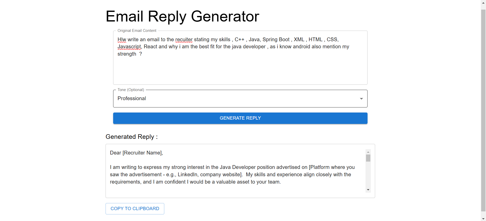

# Email Reply Generator

## Description
This is a full-stack Email Reply Generator application built using **React** (Frontend) and **Spring Boot** (Backend). The application generates personalized email replies based on user input.

- **Frontend**: React application with Material-UI for UI and Axios for HTTP requests.
- **Backend**: Spring Boot API that handles the email reply generation logic.

## Features
- User inputs original email content.
- Choose tone (Professional, Casual, Friendly).
- Generate email replies.
- Copy generated reply to clipboard.

## Screenshots

## Backend (Spring Boot) Setup

1. Clone the repository.
2. Open the `email-writer-sb` folder.
3. Run `mvn spring-boot:run` to start the backend server.

## Frontend (React) Setup

1. Clone the repository.
2. Open the `frontend` folder.
3. Run `npm install` to install dependencies.
4. Run `npm start` to start the frontend server.

## License
MIT License
